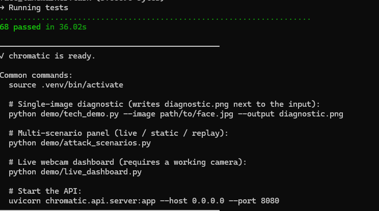

# Chromatic

A proof of concept for multi-modal liveness detection — the kind of system
that sits in front of a remote-onboarding flow at a bank and decides
whether the face in the camera belongs to a real, present human.


---

## What this is, and what it isn't

This repository is a working POC. It implements the signal-processing and security scaffolding for a deepfake-resistant liveness check, packaged the way I think it should be packaged for a production deployment — hardened
container, OWASP-aligned controls, threat model, CI with SAST and image scanning. It is **not** a finished product. The things it does not yet do are listed plainly in [docs/ROADMAP.md](docs/ROADMAP.md), and there is a
short summary further down this page.

I built it because most portfolio projects in this space show either a single trained model with no surrounding system, or a system with no security controls. The interesting engineering — for me, and I'd argue
for any security-leaning ML role — lives in the gap between those two.

---
## TL;DR

Chromatic is a multi-layer liveness detection pipeline designed for adversarial remote identity verification environments.

It combines:
- PRNU hardware fingerprinting
- rPPG biological signal analysis
- texture forensics
- head-pose validation
- optical-flow/blink analysis

The project includes:
- hardened container deployment
- OWASP-aligned controls
- CI/CD security scanning
- audit-safe logging
- threat modelling

The focus is production-oriented security engineering rather than benchmark-only ML experimentation.

--- 

## The problem

Remote identity verification is built on a single bet: that the face on the user's camera is a real, present human. That bet is increasingly hard to win. The attack surface has grown in three directions at once.

**Presentation attacks** are the oldest class. A printed photo held up to the camera, a phone playing a recorded video, a 3D-printed mask. These worked against early systems and still work against single-signal ones.

**Digital injection attacks** bypass the camera entirely. A virtual camera driver replaces the live feed with a pre-recorded or synthesised stream. The signal that reaches the application is pixel-perfect, but it
never passed through a real lens.

**Synthetic media attacks** — what most people mean by "deepfake" — use a generative model to produce a face in real time. The output is plausible to a human observer and to many ML classifiers. The quality has improved
faster than detection methods have.

A single defensive layer is fragile against all three. A liveness check that depends only on blink detection is defeated by any video replay. A check that depends only on a learned classifier is defeated when the
attacker's generator gets better than the defender's discriminator. The practical answer is to combine signals that fail in uncorrelated ways, so the attacker has to defeat all of them at once.

---

## The approach

Chromatic runs five independent layers over each frame, then combines them with a transparent linear weighted sum. The signals were chosen specifically because they cost very different amounts to spoof.

### Layer 1 — Hardware forensics (PRNU)

Every camera sensor has a unique noise fingerprint, the Photo-Response Non-Uniformity. It comes from microscopic variation between photosites during fabrication, and it cannot be removed without destroying the
image. By subtracting a denoised copy of the frame from the original you get a residual that contains this fingerprint plus shot noise.

For a real capture, the residual has Gaussian-like statistics with kurtosis near zero. For a replayed image — one that has already been through a JPEG encoder, a screen, and a second sensor — the residual
shows quantisation artefacts. For a fully synthesised frame, the fingerprint is either missing or doesn't match the calibrated reference.

This is the layer that catches a phone screen pointed at the camera.

Reference: Lukáš, Fridrich & Goljan, *Digital Camera Identification from Sensor Pattern Noise*, IEEE TIFS 2006.

### Layer 2 — Biological signals (rPPG)

When your heart beats, the volume of blood in the capillaries just under your skin changes slightly. That changes how much light is absorbed. A camera can measure this from the green channel of a forehead crop, because oxygenated haemoglobin absorbs green strongly. The signal is faint — about one part in two hundred of the mean — and easily lost in motion and lighting noise, but it is there.

The CHROM algorithm projects the RGB signal onto a chrominance plane where the motion artefacts cancel out, then band-passes the result to the physiological heart-rate range (0.7 to 3.5 Hz, which is 42 to 210 BPM). If the result has a clear peak in that band with reasonable SNR, the frame is consistent with a live human. If the spectrum is flat or the peak is outside the band, it isn't.

A printed photo has no pulse. A video replay has the source person's pulse but at the wrong rate after temporal compression. A real-time deepfake would need to synthesise a coherent rPPG signal in addition to everything else.

Reference: De Haan & Jeanne, *Robust pulse-rate from chrominance-based rPPG*, IEEE TBME 2013. 

### Layer 3 — Texture analysis

A printed photo has paper texture. A phone screen has a sub-pixel grid that produces more interference when sampled by another camera. Both leave a signature in the frequency domain: paper concentrates energy in mid-frequency bands, screens concentrate it at the screen's pixel pitch. A real face shines diffusely and produces a smoothly falling spectrum.

The texture layer computes Laplacian variance (a blur measure) and looks for periodic energy concentration in the 2D FFT.

### Layer 4 — Geometry consistency

MediaPipe's FaceLandmarker produces 468 3D landmarks per frame. We use six of them — nose tip, chin, eye corners, mouth corners — together with their canonical 3D positions to recover head pose by `cv2.solvePnP`.

This doesn't directly catch a deepfake, but it catches the degenerate case where the face isn't actually a face in normal viewing pose: a photo held at an angle, a 2D-rendered avatar, a synthesised head whose geometry doesn't satisfy projective consistency across pose changes.

### Layer 5 — Motion and blink detection

A real human is never perfectly still. Sub-pixel head sway, small saccades, blinks every four to six seconds, these are involuntary and hard to fake without doing it on purpose. We compute dense optical flow (Farnebäck) on the face crop and track the eye-aspect-ratio (Soukupová & Čech) over a rolling window to detect blinks.

A static photo has zero motion. A looped GIF or short video has suspiciously periodic motion. A live human has a particular kind of ragged, low-amplitude movement that is easy to detect once you know what you're looking for.

### Fusion

The five layer scores, each in [0, 1], are combined with a fixed weighted sum. Default weights: hardware 0.25, rPPG 0.25, motion 0.20, geometry 0.15, texture 0.15. 

I chose a linear weighted sum over a learned ensemble deliberately. In a regulated industry, an auditor will eventually ask "why did the system reject this user". A weighted sum has an answer in plain language — "because the rPPG layer scored 0.2 and the geometry layer scored 0.1, and the weighted total didn't clear the threshold". A learned ensemble has an answer in the form of feature attributions, which is much harder to defend.

The fused score must also exceed the threshold for a sustained window (default 30 of the last 30 frames at ≥0.65) before the verdict flips to LIVE. This kills transient false positives.

---

## Security posture

The detector is one part of the system. The other part is the surrounding controls that determine what happens to the frames after they arrive.

### Input validation

Every frame is type-checked, shape-checked, size-bounded, and rejected if it contains NaN or Inf. The validator is mapped to specific clauses of the OWASP Application Security Verification Standard (ASVS 5.1).

### Audit logging

Every authorisation decision emits a structured JSON line to a dedicated logger. Principal identifiers are SHA-256-hashed with a per-deployment salt before being written. The logs are designed to survive an export to
a SIEM (Splunk, Sentinel) without any PII transformation.

### Rate limiting

Per-principal token bucket. Returns HTTP 429 with `Retry-After` set, emits an audit event, never blocks the event loop.

### Container

Multi-stage Dockerfile. Final image runs as a non-root user (UID 10001), read-only filesystem, all Linux capabilities dropped, `no-new-privileges`, healthcheck against the unprivileged HTTP port. Tini as PID 1 for clean signal forwarding.

### CI

`ruff` (lint and format), `mypy` (types), `pytest` (68 tests, 80% coverage on a 70% gate), `bandit` (SAST), `gitleaks` (secrets in history), `pip-audit` (dependency CVEs), `trivy` (filesystem and image CVEs). All SARIF outputs are uploaded to the GitHub Security tab.

### Documentation

A STRIDE threat model with an attack tree and a mitigation map is in [docs/THREAT_MODEL.md](docs/THREAT_MODEL.md). The full security control list is in [docs/SECURITY.md](docs/SECURITY.md).

---

## What's deliberately incomplete

This is still in a development phase and have some imitations right now:

**No public-dataset benchmarks.** The pipeline is verified to be functionally correct on synthesised inputs and a single still image. There are no equal-error-rate or AUROC numbers against FaceForensics++, Celeb-DF v2, or DFDC. Those evaluations are the first item on [docs/ROADMAP.md](docs/ROADMAP.md).

**No trained ML classifier yet.** The architecture document describes a sixth layer based on a ML backbone and anomaly scoring. The current implementation prioritises deterministic signal-processing layers and interpretable fusion logic. A learned anomaly-scoring layer is planned as a future augmentation rather than a replacement for the existing pipeline.

**Live camera not validated end-to-end in development.** The dashboard runs against video files cleanly. The webcam code path opens the default camera with `cv2.VideoCapture(0)` and the same code has worked for me on Linux historically, but I haven't tested it across multiple hardware configurations in this iteration. If you fork it, this is the first thing to check.

## Future Work

- Streaming inspection via WebSockets
- Distributed worker queues for horizontal scaling
- Policy-as-code integrations
- Adaptive risk scoring
- Enterprise identity-aware enforcement
- Kubernetes-native deployment model
- Structured audit export pipelines

---

## Running it

There are four ways to use the system. Full details with input
requirements are in [docs/USING_YOUR_OWN_DATASET.md](docs/USING_YOUR_OWN_DATASET.md).

```bash
# One-shot setup: venv, install, model download, smoke test
bash scripts/setup.sh
source .venv/bin/activate

# 1. Diagnostic panel for a single image
python demo/tech_demo.py --image path/to/face.jpg --output diag.png

# 2. Comparison of LIVE / STATIC PHOTO / SCREEN REPLAY scenarios
python demo/attack_scenarios.py --image path/to/face.jpg --output panel.png

# 3. Real-time dashboard against a webcam (or replay a video)
python demo/live_dashboard.py
python demo/live_dashboard.py --replay clip.mp4

# 4. Batch evaluation over a labelled directory
python scripts/eval_folder.py --input clips/ --output results.csv \
    --label-from parent
```

For the API:

```bash
uvicorn chromatic.api.server:app --host 0.0.0.0 --port 8080
```

For Docker:

```bash
docker compose -f docker/docker-compose.yml up --build
```

---

## Repository layout

```
chromatic/
├── src/chromatic/
│   ├── core/              detector, face_analyzer, rppg, prnu, texture,
│   │                      motion, fusion
│   ├── security/          input validators, audit log, rate limiter
│   ├── config/            immutable settings, env-var loader
│   ├── api/               FastAPI server scaffolding
│   └── exceptions.py
├── tests/                 unit, integration, security  (68 tests)
├── demo/                  tech_demo, attack_scenarios, live_dashboard
├── docs/                  ARCHITECTURE, THREAT_MODEL, SECURITY,
│                          DEPLOYMENT, SDLC, API, ROADMAP,
│                          USING_YOUR_OWN_DATASET
├── docker/                Dockerfile, docker-compose.yml
├── scripts/               setup, download_models, eval_folder
└── .github/workflows/     ci.yml, security.yml
```

---

## License and references

MIT, see [LICENSE](LICENSE).

Key references — papers that the implementation actually follows:

- De Haan, G. and Jeanne, V. (2013). *Robust pulse-rate from
  chrominance-based rPPG*. IEEE Transactions on Biomedical Engineering.
- Lukáš, J., Fridrich, J. and Goljan, M. (2006). *Digital camera
  identification from sensor pattern noise*. IEEE Transactions on
  Information Forensics and Security.
- Soukupová, T. and Čech, J. (2016). *Real-time eye blink detection
  using facial landmarks*. CVWW.
- Farnebäck, G. (2003). *Two-frame motion estimation based on polynomial
  expansion*. SCIA.

Benchmark datasets referenced in the roadmap (not redistributed here,
each requires accepting the dataset owner's EULA):

- Rössler et al. (2019). *FaceForensics++: Learning to Detect
  Manipulated Facial Images*.
- Li et al. (2020). *Celeb-DF: A Large-scale Challenging Dataset for
  DeepFake Forensics*.
- Dolhansky et al. (2020). *The DeepFake Detection Challenge (DFDC)
  Dataset*.


# Running it
\chromatic> bash scripts/setup.sh


